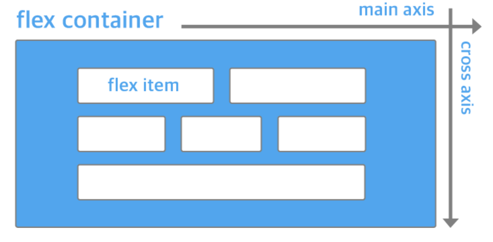
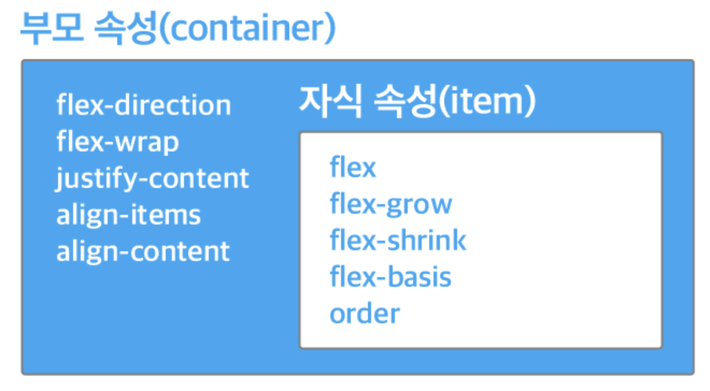

# 서론

FE 개발을 하다보면 일반적인 개발파트 업무(html, xml, js)영역 보다 디자인 업무가 가장 까다롭게 느껴질 때가 있다. 아무래도 디자인을 전공하지 않았기에 디테일하게 디자인적인 요소를 보지 못하는 경우가 있고, 디자인 자체 요소에 포커스를 두기 보다는 기능 구현에 포커스를 두고 개발하던 습관이 있기 때문에 사사로운 디자인 구현에 신경을 덜 쓰는 이유도 있는듯 하다. <br>
CSS를 심도 있게 공부하지 않은 상태에서 CSS를 활용하여 디자인을 완성하기에는 어려움이 있지만 자주 쓰이는 개념부터 하나씩 정리해나간다면 일반적인 디자인 영역의 구현은 커버할 수 있을듯 하다.
이러한 목적을 두고 css에서 주요하게 쓰이는 `flex` 요소에 대해 알아보도록 한다.
<br><br>

# 1. flex란 무엇인가?
flexbox는 뷰포트나 요소의 크기가 불명확하거나 동적으로 변할 때에도 효율적으로 요소를 배치, 정렬, 분산할 수 있는 방법을 제공하는 CSS3의 새로운 레이아웃 방식이다. flexbox의 장점을 한 마디로 표현하면 '복잡한 계산 없이 요소의 **크기**와 **순서**를 유연하게 배치할 수 있다'라고 할 수 있다. 정렬, 방향, 순서, 크기 등을 유연하게 조절할 수 있기 때문에 별도의 분기 처리를 줄일 수 있고, CSS만으로 다양한 레이아웃을 구현할 수 있다.

## flex의 구성
flex의 개념에는 크게 Container 개념과 item 개념이 존재한다. flex 스타일을 설정한 요소가 부모가 되고 자동으로 그 안에 있는 하위 요소들은 item의 개념으로 지정된다.
flex를 선언하는 방법은 간단하다. 
```
display: flex
```
위의 속성값을 지정하면 지정한 요소가 flex container가 되고 하위 요소들은 flex item이 된다. 이 둘의 관계는 `ul` 과 `li` 의 관계로 생각하면된다.
<br><br>


<br>
위의 그림과 같이 flex의 방향에는 크게 2가지가 있다.<br>

**1. main axis : 정렬의 주축** <br>
**2. cross axis : 정렬의 수직인 축**<br>

flex 스타일에서 item들의 방향을 설정하는 방법은 flex-direction 속성값을 통해 지정할 수 있다.<br>
```
flex-direction : row 
flex-direction : column 
```
row 값은 방향이 왼쪽에서 오른쪽으로 흐르는 방향이고, column은 위에서 아래로 흐르는 방향을 뜻한다. 속성값을 따로 명시하지 않으면 default로 row 방향이 설정된다.

<br><br>

## flex container와 flex item의 속성 종류
위에서 언급했듯이 flex라는 스타일은 선언함과 동시에 2가지 영역이 생기게 된다. 따라서 어느 범위에서 어떤 속성을 설정하는지 아는것도 매우 중요하다. 
- flex container 속성: flex-direction, flex-wrap, justify-content, align-items, align-content
- flex item 속성: flex, flex-grow, flex-shrink, flex-basis, order

<br>



위의 사진설명에서 나와있듯이 부모와 자식 영역 각각에 줄 수 있는 속성은 다르다. 간략하게 먼저 살펴보면 부모 영역에서는 자식들(item)의 정렬 방향, 완전히 감싸는 유무, 아이템간의 간격, 아이템 정렬 방식(앞, 가운데, 뒤) 등의 속성을 설정할 수 있고, <br>
자식 영역에서는 화면의 크기가 줄거나 늘어났을때 자식들간의 크기 비율에 대해 설정하는 요소들이 존재한다.<br>
부모영역에서 전체적인 아이템의 정렬방식을 결정한다면 자식요소에서는 각 아이템들의 세부적인 크기에 대해 설정한다고 보면 될것 같다.
<br><br>

다음 포스팅 부터는 flex를 활용한 다양한 레이아웃의 예시와 구체적인 속성값의 설정 방법에 대해 알아보고자 한다.