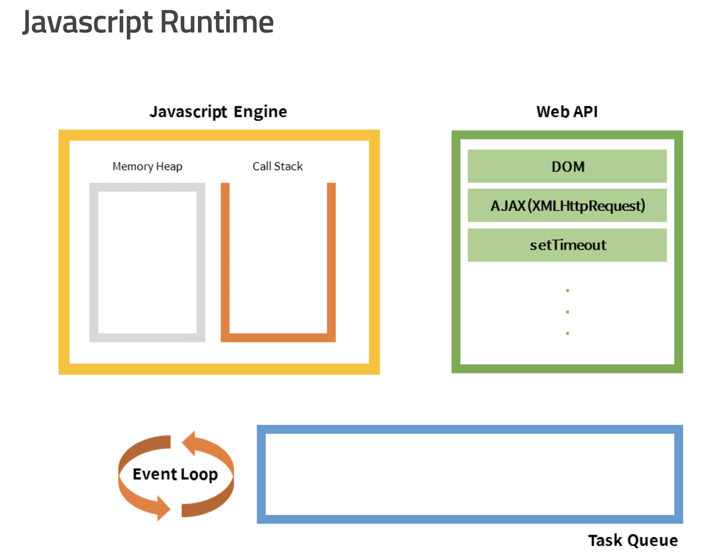

## 서론
이번 포스팅은 문법적ㅇ니 React의 특징을 정리한 내용이라기 보다는 ReactJS 기반의 프로그램을 개발할때 느꼈던 특징들에 대해 정리한 글입니다. Javascript 문법과 ReactJS 문법이 아직 완벽히 익숙하지 않은 상태에서 느껴지는 프로그래밍 언어들의 powerful 한 특징들입니다.

## Javascript는 비동기적 언어
Java나 C언어, 파이썬과 같은 절차,객체지향적인 프로그래밍 언어에 익숙한 사람들에게는 JS 문법을 바로 익혀 사용하기에는 몇 가지 큰 장애물들이 존재한다. 그 중에 가장 큰 특징은 바로 비동기성 특징이 있다.
  

 
위의 JS의 Runtime 구조를 확인해보면 우리가 일반적으로 알고 있는 CallStack (스택) 구조가 있고, 함수들이 호출된 순서대로 차례차례 쌓이며  `Run-to-completion` 방식으로 실행된다. 
##하지만 AJAX 통신이나 setTime과 같이 비동기처리 함수를 만나게 되면 그 순서는 달라진다.##