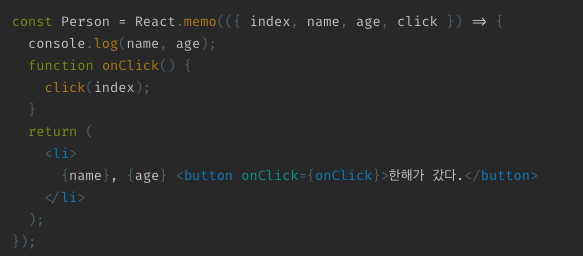

# React 앱을 최적화 하는 방법

간략 요약 : 리액트를 포함한 SPA에서 실제 DOM을 그리는데 가장 많은 비용이 들기 때문에 렌더링을 최소화 하는게 가장 중요하다.
하지만 해당 컴포넌트가 리렌더링 되는데는 아래와 같은 4가지 경우가 존재 한다.

 

1. Props가 변경되었을 때
2. State가 변경되었을 때
3. 부모 컴포넌트가 렌더링되었을 때
4. (forceUpdate() 를 실행하였을 때) -> 드문 경우

 

따라서 위의 3가지 경우에 발생할 수 있는 뜻밖의 렌더링 경우를 모두 코드로 처리해야 `내가 원하는 상황에서만 해당 컴포넌트를 렌더링하여 view를 최적화 할 수 있다.` 만약 자식 컴포넌트와 상관도 없는 부분에서 부모 컴포넌트의 일부 text 값이 바뀌었을 때 자식 컴포넌트 또한 새로 만든다면 억울한 리렌더링이 될 수 있다. 아래 몇 가지 케이스들은 이러한 억울한 리렌더링 상황을 막을 수 있는 방법들이다.

  

## 1. props로 리터럴 함수 생성후 전달 지양
리터럴 함수를 props로 전달하게 되면 해당 컴포넌트가 리렌더링 될 때마다 리터럴 객체가 새로 생성되면서 주소값이 변경되어 props가 변경되었다고 판단할 수 있다. 따라서 리터럴 함수로 생성하는 것을 지양하고 아래 나와있는 useCallback 을 사용하여 변하지 않은 함수의 경우 재사용되도록 처리해야 한다.

func = {()=> setCount(count+1)}  이 경우 렌더링 될때마다 새로 생성한다. 따라서 useMemo로 감싼 TestMemo 컴포넌트라 할지라도 useMemo는 얕은 비교를 하기 때문에 다른 결과가 들어왔다고 이해하고 리렌더링을 실행하게 된다.

  

## 2. 변하지 않는 상수 데이터 사용
-> 상태에 영향을 받지 않는 상수 데이터의 경우 컴포넌트 함수 외부에서 정적으로 생성

  

## 3. 함수 메모이제이션 (useCallback)
사용되는 함수를 useCallback으로 감싸 함수 재생성의 비용을 줄인다. 함수가 재생성되어야 하는 경우는 함수 인자(parameter)가 아닌 함수 의존성( 함수 안에 사용되는 값들)을 배열 형태로 받아서 판단 하게된다.

아래 코드의 경우 첫번째 버튼을 클릭했을때 콘솔창에
'버튼1 1 0 ' 이렇게 3개의 텍스트가 찍힌다. 그 이유는 count1 state가 변하게 되면 Counter 컴포넌트가 리렌더링 하게 되고, 그때 increment1, increment2 함수가 재생성되게 된다. 그러면 이 함수의 참조값이 변하기 때문에 Button 컴포넌트가 props의 변경으로 인지하여 Button 또한 리렌더링 되는것이다. 이런 경우를 막기 위해 useCallback을 사용하여 해당 함수가 변하는 경우에만 함수가 재생성되도록 처리할 수 있다.

  

## 4. 값 메모이제이션 ( useMemo)
PureComponent나 값의 경우 렌더링시 새로 생성되는 것이 아니라 useCallback 과 마찬가지로 의존성 값들의 변동시에만 재생성된다. 

props의 message값이 바뀌었을때만 해당 render 영역이 재생성된다. 만약 두번째 인자(배열)에 빈값을 주게 되면 마운트시에만 생성되고 그 이후로는 update 되지 않는 불변의 값 또는 함수가 된다

예시) 피보나치 수열을 계산하는 function Fibo(num) { ... } 이 존재할때 입력받은 num이 같은 값이라면 굳이 재 계산하지 않아도 결과 값을 알 수 있기 때문에 이런 함수의 경우 useMemo를 감싸면 동일 의존성값에 대해 재 계산하는 비용을 줄일 수 있게 된다.

  

## 5. React.memo

특정 view component를 React.memo로 감싸서 생성하게 되면 해당 컴포넌트가 전달받은 props를 1차 레벨 비교를 하여 같다면 리렌더링하지 않게 막아준다. 아래 코드에서는 전달받은 index, name, age, click 값이 변하지 않았다면 자식 컴포넌트인 Person 컴포넌트의 리렌더링을 막아준다.

  

## 6. 거대한 리스트 데이터 가상화
 많은 양의 데이터를 List에 나타낼때는 react-virtualized를 사용하여 viewport에 보여지는 부분만 렌더링 하고 나머지는 스크롤할 때 보여지도록 처리한다.

  

## 7. Caching functions
함수 실행이 오래 걸릴 경우, 렌더링 하는 나머지 부분이 대기하게 되어 사용자들에게 긴 로딩시간을 줄 수 있다. 따라서 아래 예시 코드 처럼 컴포넌트 안에 데이터의 양이 큰 부분이 있다면 별도로 분리하여 해당 부분을 메모이제이션 함수로 감싼 후 처리하게 되면 입력값이 같을 경우 캐시된 값을 리턴하여 실행을 더 빠르게 만들 수 있다.

  

## 8. shouldComponentUpdate() 사용
해당 컴포넌트에서 사용되는 state 값이 동일 할 때는 리렌더링 되지 않도록 처리하는 코드가 필요하다.

  

## 9. 부모 자식 컴포넌트의 관계 느슨화

위와 같은 코드를 아래 코드로 변경하게 되면 Parent 컴포넌트가 렌더링하더라도 Child 컴포넌트는 리렌더링 하지 않는다. 단 위의 경우는 Child 컴포넌트가 Parent로 부터 state 값을 넘겨 받을게 없는 구조일때 가능하다. 따라서 redux를 사용하는 프로젝트라면 부모와 자식간의 state 전달이 적기 때문에 해당 방법으로 부모-자식 간의 리렌더링 최소화를 구현할 수 있다.
